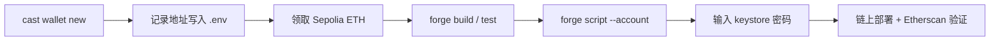

# Cast Wallet 与 Keystore 完整指南

本文档介绍 Foundry 中 `cast wallet` 的用途、如何创建与管理 keystore，以及如何在本项目（`foundry-learn-demo`）中使用 keystore 部署 `MyToken` 到 Sepolia。

## 目录

1. [核心概念](#核心概念)
2. [cast wallet 是什么](#cast-wallet-是什么)
3. [创建 Keystore](#创建-keystore)
4. [管理 Keystore](#管理-keystore)
5. [配置项目环境](#配置项目环境)
6. [使用 Keystore 部署 MyToken](#使用-keystore-部署-mytoken)
7. [部署脚本说明](#部署脚本说明)
8. [常见问题](#常见问题)
9. [安全建议](#安全建议)

---

## 核心概念

| 概念 | 说明 |
|------|------|
| **私钥（Private Key）** | 64 字节十六进制字符串，可完全控制账户资产。**绝不能泄露或提交到 Git** |
| **地址（Address）** | 由私钥推导的公链账户标识（如 `0xff29...`），可公开分享，用于收款和查询余额 |
| **Keystore** | 用密码加密后的私钥 JSON 文件（Geth 标准格式），私钥不以明文保存 |
| **cast wallet** | Foundry 提供的钱包管理 CLI，用于创建、导入、列出、删除 keystore 等 |
| **forge script --account** | 部署时用 keystore 账户签名交易，执行时会提示输入 keystore 密码 |

### Keystore vs 在 .env 里写 PRIVATE_KEY

| 方式 | 优点 | 缺点 |
|------|------|------|
| `.env` 中的 `PRIVATE_KEY` | 配置简单，适合本地快速测试 | 明文私钥易误提交、泄露 |
| **Keystore + `--account`** | 私钥加密存储，部署时输入密码 | 需多配一个公链地址；脚本不能依赖 `vm.getWallets()` |

本项目部署脚本已改为 **Keystore 方式**，不再从 `.env` 读取 `PRIVATE_KEY`。

---

## cast wallet 是什么

`cast wallet` 是 Foundry 工具链 `cast` 下的**钱包管理子命令**，用于在本地管理以太坊账户，而无需每次把私钥写在环境变量里。

### 查看所有子命令

```bash
cast wallet --help
```

常用子命令一览：

| 命令 | 别名 | 作用 |
|------|------|------|
| `new` | `n` | 生成新钱包；指定目录则写入加密 keystore |
| `import` | `i` | 将已有私钥或助记词导入 keystore |
| `list` | `ls` | 列出 keystore 目录中的账户 |
| `address` | `a`, `addr` | 查看 keystore 或私钥对应的地址 |
| `remove` | `rm` | 删除 keystore 文件 |
| `change-password` | `cp` | 修改 keystore 密码 |
| `decrypt-keystore` | `dk` | 解密 keystore 得到私钥（慎用） |
| `new-mnemonic` | `nm` | 生成 BIP39 助记词 |
| `private-key` | `pk` | 从助记词推导私钥 |
| `sign` / `verify` | `s` / `v` | 签名 / 验证消息 |

### 默认存放路径

Keystore 默认目录：

```text
~/.foundry/keystores/
```

每个账户对应一个文件，**文件名即账户名**（你在创建时指定的名字，如 `deployer_1`）。

---

## 创建 Keystore

### 方式一：新建随机钱包（推荐）

生成 **1 个** 加密 keystore：

```bash
cast wallet new ~/.foundry/keystores deployer_1
```

执行后会：

1. 提示输入 **加密密码**（用于保护 keystore，请牢记）
2. 在 `~/.foundry/keystores/` 下生成文件 `deployer_1`
3. 在终端打印该账户的 **地址**（请记录下来，后面要写入 `.env` 的 `DEPLOYER_ADDRESS`）

一次生成多个账户（名称会带后缀 `_1`、`_2`…）：

```bash
cast wallet new ~/.foundry/keystores deployer -n 3
```

示例输出：

```text
Created new keypair.
~/.foundry/keystores/deployer_1
Address: 0xff2903AF954a5EA4F093ce1dDA940A3bDD1a79E8
```

> **注意**：不带路径的 `cast wallet new` 只会在终端打印私钥，**不会**生成 keystore 文件。要得到加密文件，必须写上目录路径。

### 方式二：从已有私钥导入

适合从 MetaMask 导出私钥后导入 Foundry：

```bash
cast wallet import my-account -i
```

按提示输入私钥和密码。也可指定目录：

```bash
cast wallet import my-account --keystore-dir ~/.foundry/keystores
```

从助记词导入：

```bash
cast wallet import my-account --mnemonic "word1 word2 word3 ..."
```

### 方式三：仅生成助记词（不直接生成 keystore）

```bash
cast wallet new-mnemonic
```

得到 12/24 个英文单词后，再用 `import --mnemonic` 导入为 keystore。

---

## 管理 Keystore

### 列出所有账户

```bash
cast wallet list
```

示例：

```text
deployer_1 (Local)
deployer_2 (Local)
```

### 查看某账户地址

```bash
cast wallet address --account deployer_1
```

会提示输入 keystore 密码，然后输出地址。该地址即 `.env` 中 `DEPLOYER_ADDRESS` 应填的值。

### 修改密码

```bash
cast wallet change-password deployer_1
```

### 删除账户

```bash
cast wallet remove deployer_1
```

### 解密查看私钥（高风险，仅调试使用）

```bash
cast wallet decrypt-keystore ~/.foundry/keystores/deployer_1
```

---

## 配置项目环境

### 1. `.env` 文件

项目根目录 `.env` 示例（**不要提交到 Git**，已在 `.gitignore` 中忽略）：

```env
SEPOLIA_RPC_URL=https://ethereum-sepolia-rpc.publicnode.com

# 与 --account 使用的 keystore 对应的公链地址（非私钥，可视为公开信息）
DEPLOYER_ADDRESS=0x你的deployer_1地址

ETHERSCAN_API_KEY=你的Etherscan_API_Key
```

| 变量 | 是否敏感 | 说明 |
|------|----------|------|
| `SEPOLIA_RPC_URL` | 低 | Sepolia RPC 节点地址 |
| `DEPLOYER_ADDRESS` | 否 | 部署者公链地址，须与 `--account` 账户一致 |
| `ETHERSCAN_API_KEY` | 中 | 用于合约验证，勿公开分享 |
| ~~`PRIVATE_KEY`~~ | **极高** | 本项目已不用，请勿再配置 |

`DEPLOYER_ADDRESS` 获取方式：

- 创建 keystore 时终端打印的 `Address: 0x...`
- 或运行：`cast wallet address --account deployer_1`

### 2. `foundry.toml`

本项目已配置 Sepolia RPC 与 Etherscan 验证：

```toml
[rpc_endpoints]
sepolia = "${SEPOLIA_RPC_URL}"

[etherscan]
sepolia = { key = "${ETHERSCAN_API_KEY}" }
```

### 3. 领取 Sepolia 测试 ETH

部署前，向 `DEPLOYER_ADDRESS` 对应地址领取测试 ETH：

- [Alchemy Sepolia Faucet](https://www.alchemy.com/faucets/ethereum-sepolia)
- [Google Cloud Sepolia Faucet](https://cloud.google.com/application/web3/faucet/ethereum/sepolia)

---

## 使用 Keystore 部署 MyToken

### 流程概览



### 第 1 步：编译与测试

```bash
forge build
forge test --match-contract MyTokenTest
```

### 第 2 步：本地 Anvil 试部署（可选）

终端 1 启动本地链：

```bash
anvil
```

终端 2 部署（会提示输入 keystore 密码）：

```bash
forge script script/MyToken.s.sol:MyTokenScript \
  --rpc-url http://127.0.0.1:8545 \
  --account deployer_1 \
  --broadcast
```

> Anvil 默认账户自带 ETH；若用新建的 keystore 地址，需先用 `cast send` 或 `anvil_setBalance` 给该地址充值。

### 第 3 步：部署到 Sepolia 并验证

```bash
forge script script/MyToken.s.sol:MyTokenScript \
  --rpc-url sepolia \
  --account deployer_1 \
  --broadcast \
  --verify \
  -vvvv
```

| 参数 | 作用 |
|------|------|
| `--rpc-url sepolia` | 使用 `foundry.toml` 中的 Sepolia RPC |
| `--account deployer_1` | 使用 `~/.foundry/keystores/deployer_1` 签名（**账户名须与文件名一致**） |
| `--broadcast` | 实际发送链上交易 |
| `--verify` | 在 Etherscan 上自动验证合约源码 |
| `-vvvv` | 输出详细日志，便于排查 |

成功后会看到类似输出：

```text
ONCHAIN EXECUTION COMPLETE & SUCCESSFUL.
Contract successfully verified
```

### 签名与地址如何配合

部署时有两处配置，**必须指向同一账户**：

| 配置位置 | 作用 |
|----------|------|
| `--account deployer_1` | 用哪个 keystore **签名**交易 |
| `.env` 的 `DEPLOYER_ADDRESS` | 脚本里 `MyToken` 的 **owner** 是谁 |

若 `--account` 是 `deployer_1`，则 `DEPLOYER_ADDRESS` 必须是 `deployer_1` 的地址，不能填 `deployer_2` 的地址。

---

## 部署脚本说明

当前 `script/MyToken.s.sol`：

```solidity
contract MyTokenScript is Script {
    function run() external {
        address deployer = vm.envAddress("DEPLOYER_ADDRESS");

        vm.startBroadcast(deployer);

        new MyToken(deployer);

        vm.stopBroadcast();
    }
}
```

要点：

1. **`vm.envAddress("DEPLOYER_ADDRESS")`**：从 `.env` 读取公链地址，作为 `MyToken` 的 `initialOwner`
2. **`vm.startBroadcast(deployer)`**：指定由该地址签名广播；实际私钥由 CLI 的 `--account` 从 keystore 解密
3. **不再使用 `PRIVATE_KEY`**：私钥只存在于加密 keystore 中

### 为什么不用 `vm.getWallets()[0]`？

使用 `forge script --account` 时，`vm.getWallets()` 往往返回空数组 `[]`，访问 `[0]` 会触发：

```text
panic: array out-of-bounds access (0x32)
```

因此在脚本中通过 `DEPLOYER_ADDRESS` 显式传入公链地址，是稳定可靠的做法。

---

## 常见问题

### 1. `environment variable "DEPLOYER_ADDRESS" not found`

**原因**：`.env` 中未配置 `DEPLOYER_ADDRESS`，或不在项目根目录执行命令。

**解决**：在项目根目录 `.env` 添加：

```env
DEPLOYER_ADDRESS=0x你的地址
```

### 2. `panic: array out-of-bounds access (0x32)`

**原因**：脚本中使用了 `vm.getWallets()[0]`，但 `getWallets()` 返回空数组。

**解决**：改用 `vm.envAddress("DEPLOYER_ADDRESS")`（见上文部署脚本）。

### 3. `Enter keystore password` 后仍失败 / 签名错误

**原因**：密码错误，或 `--account` 名称与 keystore 文件名不一致。

**解决**：

```bash
cast wallet list   # 确认账户名
ls ~/.foundry/keystores/
```

确保命令中是 `--account deployer_1`，而不是 `deployer`。

### 4. `insufficient funds for gas`

**原因**：`DEPLOYER_ADDRESS` 在 Sepolia 上余额不足。

**解决**：向该地址领取测试 ETH 后重试。

### 5. `--account` 与 `DEPLOYER_ADDRESS` 不一致

**现象**：部署成功，但 `MyToken` 的 owner 不是 keystore 账户。

**解决**：`cast wallet address --account deployer_1` 得到的地址，必须与 `.env` 中 `DEPLOYER_ADDRESS` 完全一致。

### 6. 避免每次输入密码（可选）

可将密码写入本地文件（**切勿提交 Git**）：

```bash
echo "你的keystore密码" > ~/.foundry/password.txt
chmod 600 ~/.foundry/password.txt
```

部署时：

```bash
forge script script/MyToken.s.sol:MyTokenScript \
  --rpc-url sepolia \
  --account deployer_1 \
  --password-file ~/.foundry/password.txt \
  --broadcast \
  --verify
```

---

## 安全建议

1. **永远不要**将 `.env`、keystore 文件、密码文件提交到 Git
2. **永远不要**在文档、聊天、截图中暴露 keystore 密码或私钥
3. `DEPLOYER_ADDRESS` 是公开地址，可以写入 `.env`；`ETHERSCAN_API_KEY` 仍需保密
4. 测试网与主网可使用不同 keystore 账户，降低误操作风险
5. 不再使用的测试 keystore 可用 `cast wallet remove` 删除
6. 生产环境优先考虑硬件钱包；keystore 适合学习与测试网部署

---

## 命令速查表

```bash
# 创建
cast wallet new ~/.foundry/keystores deployer_1
cast wallet import deployer_1 -i

# 查询
cast wallet list
cast wallet address --account deployer_1

# 管理
cast wallet change-password deployer_1
cast wallet remove deployer_1

# 部署（本项目）
forge script script/MyToken.s.sol:MyTokenScript \
  --rpc-url sepolia \
  --account deployer_1 \
  --broadcast \
  --verify
```

---

## 相关文件

| 文件 | 说明 |
|------|------|
| `script/MyToken.s.sol` | Keystore 部署脚本 |
| `src/MyToken.sol` | ERC20 代币合约 |
| `foundry.toml` | RPC 与 Etherscan 配置 |
| `.env` | `DEPLOYER_ADDRESS`、RPC、API Key（本地专用） |
| `~/.foundry/keystores/` | 加密 keystore 存放目录 |
| `docs/deploy-mytoken-sepolia.md` | Sepolia 部署流程（历史文档，含 PRIVATE_KEY 方式） |

## 参考链接

- [Foundry Book - Deploying](https://book.getfoundry.sh/forge/deploying)
- [Foundry Book - Cast Wallet](https://book.getfoundry.sh/reference/cast/cast-wallet)
- [Sepolia Etherscan](https://sepolia.etherscan.io/)
