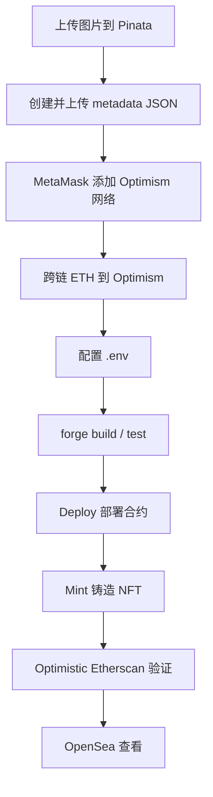

# 将 MartinNFT 部署到 Optimism 主网

本文档记录在本项目（`foundry-learn-demo`）中，从准备 metadata 到在 **Optimism 主网（OP Mainnet）** 部署 `MartinNFT`、铸造 NFT 并在 OpenSea 查看的完整流程。

---

## 流程概览



**一句话理解：**

| 步骤 | 类比 | 链上含义 |
|------|------|----------|
| 上传 metadata | 给商品写说明书 | `tokenURI` 指向 JSON，OpenSea 才能正确展示 |
| 跨链 ETH | 给 Optimism 钱包充 Gas | 主网部署需要真实 ETH |
| Deploy | 开店 | 把 NFT 合约发布到 Optimism |
| Mint | 上架商品 | 创建 `#0` 号 NFT 并绑定 metadata |

---

## 前置条件

- 已安装 [Foundry](https://book.getfoundry.sh/getting-started/installation)（`forge`、`cast`）
- 已安装 [MetaMask](https://metamask.io/)
- 已创建 Keystore 账户（见 [cast-wallet-keystore.md](./cast-wallet-keystore.md)）
- 已在 [Pinata](https://app.pinata.cloud/) 注册账号
- 项目依赖已安装：

```bash
forge install OpenZeppelin/openzeppelin-contracts
forge remappings > remappings.txt
```

---

## 第 1 步：准备图片与 Metadata

### 1.1 上传图片到 Pinata

1. 登录 Pinata → **Files** → 上传图片
2. 复制图片 **CID**

浏览器验证：

```
https://gateway.pinata.cloud/ipfs/<图片CID>
```

本项目示例图片 CID：

```
bafybeibwonj54wjoujwybjmb5bry4df5ufo5bhuiau7hk7phwsuix6os4a
```

### 1.2 创建 Metadata JSON

OpenSea 主网要求 `tokenURI` 指向 **JSON metadata**，而不是直接指向图片。

项目已提供模板 `metadata/0.json`：

```json
{
  "name": "Martin NFT #0",
  "description": "My first NFT on Optimism",
  "image": "ipfs://bafybeibwonj54wjoujwybjmb5bry4df5ufo5bhuiau7hk7phwsuix6os4a"
}
```

按需修改 `name`、`description`，保留 `image` 为你的图片 IPFS 地址。

### 1.3 上传 Metadata 到 Pinata

1. Pinata **Files** → 上传 `metadata/0.json`
2. 复制 metadata 的 **CID**
3. 浏览器验证：

```
https://gateway.pinata.cloud/ipfs/<metadata_CID>
```

应能看到 JSON 内容。Mint 时使用的地址：

```
ipfs://<metadata_CID>
```

---

## 第 2 步：MetaMask 添加 Optimism 主网

MetaMask → **Add network manually**：

| 字段 | 值 |
|------|-----|
| Network name | Optimism |
| RPC URL | `https://mainnet.optimism.io` |
| Chain ID | `10` |
| Currency symbol | `ETH` |
| Block explorer | `https://optimistic.etherscan.io` |

---

## 第 3 步：将 ETH 跨链到 Optimism

Optimism 主网使用 **ETH** 支付 Gas。MetaMask 以太坊主网里的 ETH **不会自动出现在 Optimism**，需要跨链。

### 方法一：Optimism 官方桥（推荐）

1. 打开 [Optimism Bridge](https://app.optimism.io/bridge)
2. 连接 MetaMask（当前网络：**Ethereum Mainnet**）
3. From：**Ethereum** → To：**Optimism**
4. 选择 **ETH**，输入数量（建议 ≥ `0.01 ETH`）
5. 确认交易，等待约 5～15 分钟

### 方法二：交易所直接提现

从 Binance、OKX 等交易所提现 ETH，**网络选择 Optimism**，地址填你的部署地址。

### 检查余额

```bash
cast balance $DEPLOYER_ADDRESS --rpc-url optimism --ether
```

或在 MetaMask 切换到 **Optimism** 网络查看 ETH 余额。

| 操作 | 预估 Gas |
|------|----------|
| Deploy 合约 | ~0.002–0.005 ETH |
| Mint NFT | ~0.001–0.003 ETH |
| **建议余额** | **≥ 0.01 ETH** |

---

## 第 4 步：配置环境变量

项目根目录 `.env` 示例（**勿提交 Git**）：

```env
OPTIMISM_RPC_URL=https://mainnet.optimism.io
DEPLOYER_ADDRESS=0x你的deployer_1地址
ETHERSCAN_API_KEY=你的Etherscan_API_Key

# Pinata 上传 metadata 后填写
NFT_TOKEN_URI=ipfs://你的metadata_CID

# Deploy 成功后填写
NFT_CONTRACT_ADDRESS=0x你的NFT合约地址
```

| 变量 | 说明 |
|------|------|
| `DEPLOYER_ADDRESS` | Keystore 公链地址，须与 `--account deployer_1` 一致 |
| `NFT_TOKEN_URI` | metadata JSON 的 IPFS 地址 |
| `NFT_CONTRACT_ADDRESS` | Deploy 成功后得到的合约地址 |
| `ETHERSCAN_API_KEY` | 用于合约自动验证，在 [etherscan.io/myapikey](https://etherscan.io/myapikey) 申请 |

查看 Keystore 地址：

```bash
cast wallet address --account deployer_1
```

`foundry.toml` 已配置 Optimism RPC 与 Etherscan 验证：

```toml
[rpc_endpoints]
optimism = "${OPTIMISM_RPC_URL}"
optimism_sepolia = "https://sepolia.optimism.io"

[etherscan]
optimism = { key = "${ETHERSCAN_API_KEY}", url = "https://api-optimistic.etherscan.io/api" }
optimism_sepolia = { key = "${ETHERSCAN_API_KEY}", url = "https://api-sepolia-optimistic.etherscan.io/api" }
```

---

## 第 5 步：本地编译与测试

```bash
forge build
forge test --match-contract MartinNFTTest
```

---

## 第 6 步：Deploy — 部署合约到 Optimism 主网

**作用：** 将 `MartinNFT` 合约发布到 Optimism，获得合约地址。

```bash
forge script script/DeployMartinNFT.s.sol:DeployMartinNFT \
  --rpc-url optimism \
  --account deployer_1 \
  --broadcast \
  --verify \
  -vvvv
```

| 参数 | 作用 |
|------|------|
| `--rpc-url optimism` | 连接 Optimism 主网 |
| `--account deployer_1` | 用 Keystore 签名（会提示输入密码） |
| `--broadcast` | 实际发送链上交易 |
| `--verify` | 在 Optimistic Etherscan 自动验证源码 |

成功后终端输出：

```text
MartinNFT deployed at: 0x你的合约地址
Contract successfully verified
```

**将合约地址写入 `.env`：**

```env
NFT_CONTRACT_ADDRESS=0x你的合约地址
```

浏览器查看：

```
https://optimistic.etherscan.io/address/0x你的合约地址
```

> Deploy 完成后合约中还没有 NFT，需要执行 Mint。

---

## 第 7 步：Mint — 铸造 NFT

**作用：** 在已部署合约中创建 `#0` 号 NFT，绑定 metadata，转给 owner。

确认 `.env` 中 `NFT_TOKEN_URI` 和 `NFT_CONTRACT_ADDRESS` 已填写，然后：

```bash
forge script script/MintMartinNFT.s.sol:MintMartinNFT \
  --rpc-url optimism \
  --account deployer_1 \
  --broadcast \
  -vvvv
```

Mint 脚本从 `.env` 读取 `NFT_TOKEN_URI`：

```solidity
string memory tokenUri = vm.envString("NFT_TOKEN_URI");
uint256 tokenId = nft.mint(deployer, tokenUri);
```

成功后终端输出：

```text
Minted tokenId: 0
Owner: 0x你的地址
Token URI: ipfs://你的metadata_CID
```

链上验证：

```bash
cast call $NFT_CONTRACT_ADDRESS "tokenURI(uint256)(string)" 0 --rpc-url optimism
cast call $NFT_CONTRACT_ADDRESS "ownerOf(uint256)(address)" 0 --rpc-url optimism
```

---

## 第 8 步：在 OpenSea 查看

1. 打开 [OpenSea](https://opensea.io)
2. 连接 MetaMask，网络切换到 **Optimism**
3. 访问 NFT 页面：

```
https://opensea.io/assets/optimism/0x你的合约地址/0
```

或在 OpenSea 搜索你的钱包地址 / 合约地址。

索引可能需要几分钟到几小时。若 metadata 格式正确，会显示名称、描述和图片。

---

## 合约说明

`src/MartinNFT.sol` 基于 OpenZeppelin ERC721：

| 属性 | 值 |
|------|-----|
| 名称 | MARTINNFT |
| 符号 | MCYY |
| 标准 | ERC721 + ERC721URIStorage |
| 谁可以 mint | 仅合约 owner |
| tokenId | 从 0 自增 |

---

## 可选：避免每次输入 Keystore 密码

```bash
echo "你的keystore密码" > ~/.foundry/password.txt
chmod 600 ~/.foundry/password.txt
```

部署 / Mint 时追加参数：

```bash
--password-file ~/.foundry/password.txt
```

---

## 可选：先在 Optimism Sepolia 测试

主网会消耗真实 ETH。建议先在测试网跑通全流程，命令中将 `optimism` 换为 `optimism_sepolia`：

```bash
# 测试网 Deploy
forge script script/DeployMartinNFT.s.sol:DeployMartinNFT \
  --rpc-url optimism_sepolia \
  --account deployer_1 \
  --broadcast \
  --verify \
  -vvvv

# 测试网 Mint
forge script script/MintMartinNFT.s.sol:MintMartinNFT \
  --rpc-url optimism_sepolia \
  --account deployer_1 \
  --broadcast \
  -vvvv
```

测试 ETH 水龙头：

- [Alchemy OP Sepolia Faucet](https://www.alchemy.com/faucets/optimism-sepolia)
- [Optimism Faucet](https://console.optimism.io/faucet)

浏览器：[Sepolia Optimistic Etherscan](https://sepolia-optimism.etherscan.io)

---

## 常见问题

### 1. `insufficient funds for gas`

Optimism 上 ETH 不足。从 [Optimism Bridge](https://app.optimism.io/bridge) 跨链，或从交易所提现到 Optimism 网络。

### 2. MetaMask 有 ETH，Optimism 上却是 0

主网 ETH 与 Optimism ETH 是不同网络的余额，必须通过跨链或交易所直接提到 Optimism。

### 3. `environment variable "NFT_TOKEN_URI" not found`

`.env` 中未配置 metadata 的 IPFS 地址。上传 `metadata/0.json` 到 Pinata 后填写。

### 4. OpenSea 不显示图片

确认 `NFT_TOKEN_URI` 指向 **JSON metadata**，不是图片 CID。JSON 中 `image` 字段应指向图片 IPFS 地址。

### 5. `--account` 与 `DEPLOYER_ADDRESS` 不一致

`cast wallet address --account deployer_1` 得到的地址必须与 `.env` 中 `DEPLOYER_ADDRESS` 完全一致。

### 6. Etherscan 验证 Pending 较久

属正常现象，Foundry 会自动轮询；通常几十秒内显示 **Pass - Verified**。

---

## 相关文件

| 文件 | 说明 |
|------|------|
| `src/MartinNFT.sol` | ERC721 NFT 合约 |
| `script/DeployMartinNFT.s.sol` | 部署脚本 |
| `script/MintMartinNFT.s.sol` | Mint 脚本（读取 `NFT_TOKEN_URI`） |
| `metadata/0.json` | OpenSea 兼容 metadata 模板 |
| `foundry.toml` | Optimism RPC 与 Etherscan 配置 |
| `.env` | 部署地址、合约地址、tokenURI（本地专用） |
| `docs/cast-wallet-keystore.md` | Keystore 钱包管理指南 |
| `docs/mint-nft-flow.md` | Polygon Amoy 测试网铸造流程 |

---

## 命令速查

```bash
# 查 Optimism ETH 余额
cast balance $DEPLOYER_ADDRESS --rpc-url optimism --ether

# 编译测试
forge build && forge test --match-contract MartinNFTTest

# 部署到 Optimism 主网
forge script script/DeployMartinNFT.s.sol:DeployMartinNFT \
  --rpc-url optimism --account deployer_1 --broadcast --verify -vvvv

# 铸造 NFT
forge script script/MintMartinNFT.s.sol:MintMartinNFT \
  --rpc-url optimism --account deployer_1 --broadcast -vvvv

# 链上读取 tokenURI
cast call $NFT_CONTRACT_ADDRESS "tokenURI(uint256)(string)" 0 --rpc-url optimism
```

---

## 参考链接

- [Optimism Bridge](https://app.optimism.io/bridge)
- [Optimistic Etherscan](https://optimistic.etherscan.io/)
- [OpenSea](https://opensea.io)
- [Pinata IPFS](https://app.pinata.cloud/)
- [Foundry Book - Deploying](https://book.getfoundry.sh/forge/deploying)
- [OpenZeppelin ERC721](https://docs.openzeppelin.com/contracts/5.x/erc721)
