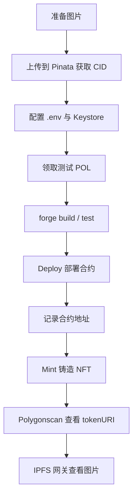

# NFT 铸造完整流程

本文档总结在本项目（`foundry-learn-demo`）中，从上传图片到在 Polygon Amoy 测试网部署合约、铸造 NFT 并查看图片的完整流程。

---

## 流程概览



**一句话理解：**

| 步骤 | 类比 | 链上含义 |
|------|------|----------|
| 上传 IPFS | 把图片存到云盘 | 获得 `ipfs://CID` 永久链接 |
| Deploy | 开店 | 把 NFT 合约发布到链上 |
| Mint | 上架第一件商品 | 创建 `#0` 号 NFT 并绑定图片链接 |

---

## 前置条件

- 已安装 [Foundry](https://book.getfoundry.sh/getting-started/installation)（`forge`、`cast`）
- 已安装 [MetaMask](https://metamask.io/)
- 已创建 Keystore 账户（见 [cast-wallet-keystore.md](./cast-wallet-keystore.md)）
- 项目依赖已安装：

```bash
forge install OpenZeppelin/openzeppelin-contracts
forge remappings > remappings.txt
```

---

## 第 1 步：上传图片到 IPFS（Pinata）

### 1.1 上传

1. 登录 [Pinata](https://app.pinata.cloud/)
2. 进入 **Files** → 上传图片（单文件或文件夹）
3. 复制返回的 **CID**

### 1.2 拼接 IPFS 地址

| 上传方式 | 地址格式 | 示例 |
|---------|---------|------|
| 单张图片 | `ipfs://<CID>` | `ipfs://bafybeib...os4a` |
| 文件夹（含 `0.png`） | `ipfs://<CID>/0.png` | `ipfs://bafybeib.../0.png` |

### 1.3 浏览器验证

将 `ipfs://` 换成 HTTP 网关地址，在浏览器打开：

```
https://gateway.pinata.cloud/ipfs/<你的CID>
```

能正常显示图片，说明 CID 正确。

### 1.4 更新 Mint 脚本（换图时）

修改 `script/MintMartinNFT.s.sol` 中的 `TOKEN_URI`：

```solidity
string internal constant TOKEN_URI =
    "ipfs://bafybeibwonj54wjoujwybjmb5bry4df5ufo5bhuiau7hk7phwsuix6os4a";
```

---

## 第 2 步：添加 Polygon Amoy 测试网（MetaMask）

MetaMask → **Add network manually**，填入：

| 字段 | 值 |
|------|-----|
| Network name | Polygon Amoy |
| RPC URL | `https://rpc-amoy.polygon.technology` |
| Chain ID | `80002` |
| Currency symbol | `MATIC` |
| Block explorer | `https://amoy.polygonscan.com` |

---

## 第 3 步：配置环境变量

项目根目录 `.env` 示例：

```env
POLYGON_RPC_URL=https://polygon-bor-rpc.publicnode.com
DEPLOYER_ADDRESS=0x你的deployer_1地址
ETHERSCAN_API_KEY=你的Etherscan_API_Key

# 部署完成后填写
NFT_CONTRACT_ADDRESS=0x你的NFT合约地址
```

| 变量 | 说明 |
|------|------|
| `DEPLOYER_ADDRESS` | Keystore 对应公链地址，须与 `--account deployer_1` 一致 |
| `NFT_CONTRACT_ADDRESS` | Deploy 成功后得到的合约地址，Mint 时使用 |
| `ETHERSCAN_API_KEY` | 用于合约自动验证，在 [etherscan.io/myapikey](https://etherscan.io/myapikey) 申请 |

查看 Keystore 地址：

```bash
cast wallet address --account deployer_1
```

---

## 第 4 步：领取测试 POL（Gas 费）

部署和 Mint 都需要测试 POL。向 `DEPLOYER_ADDRESS` 领取：

- [Polygon 官方水龙头](https://faucet.polygon.technology/)（需 GitHub / X 登录）
- [Alchemy Amoy Faucet](https://www.alchemy.com/faucets/polygon-amoy)
- [QuickNode Amoy Faucet](https://faucet.quicknode.com/polygon/amoy)

检查余额：

```bash
cast balance $DEPLOYER_ADDRESS --rpc-url polygon_amoy --ether
```

建议余额 ≥ `0.1 POL` 再部署（预估 Gas 约 `0.09 POL`）。

---

## 第 5 步：本地编译与测试

```bash
forge build
forge test --match-contract MartinNFTTest
```

---

## 第 6 步：Deploy — 部署 NFT 合约

**作用：** 把 `MartinNFT` 合约发布到链上，相当于「开店」。

```bash
forge script script/DeployMartinNFT.s.sol:DeployMartinNFT \
  --rpc-url polygon_amoy \
  --account deployer_1 \
  --broadcast \
  --verify \
  -vvvv
```

| 参数 | 作用 |
|------|------|
| `--rpc-url polygon_amoy` | 连接 Polygon Amoy 测试网 |
| `--account deployer_1` | 用 Keystore 签名（会提示输入密码） |
| `--broadcast` | 实际发送链上交易 |
| `--verify` | 在 Polygonscan 自动验证源码 |

成功后终端输出：

```text
MartinNFT deployed at: 0x900B21B1427b92FEE44EA21b3D5FD5909Ed4d67D
```

**把合约地址写入 `.env`：**

```env
NFT_CONTRACT_ADDRESS=0x900B21B1427b92FEE44EA21b3D5FD5909Ed4d67D
```

> Deploy 完成后合约是空的，还没有任何 NFT。

---

## 第 7 步：Mint — 铸造第一个 NFT

**作用：** 在已部署的合约中创建 `#0` 号 NFT，绑定 IPFS 图片，转给 owner。

```bash
forge script script/MintMartinNFT.s.sol:MintMartinNFT \
  --rpc-url polygon_amoy \
  --account deployer_1 \
  --broadcast \
  -vvvv
```

成功后终端输出：

```text
Minted tokenId: 0
Owner: 0xff2903AF954a5EA4F093ce1dDA940A3bDD1a79E8
Token URI: ipfs://bafybeibwonj54wjoujwybjmb5bry4df5ufo5bhuiau7hk7phwsuix6os4a
```

链上发生的事：

1. `tokenId = 0` 被创建
2. NFT 归属 `DEPLOYER_ADDRESS`
3. `tokenURI(0)` 指向你的 IPFS 图片

---

## 第 8 步：在 Polygonscan 查看 NFT 与图片

### 8.1 查看合约

打开合约地址页面（示例）：

```
https://amoy.polygonscan.com/address/0x900b21b1427b92fee44ea21b3d5fd5909ed4d67d
```

### 8.2 读取 tokenURI

1. 进入 **Contract** → **Read Contract**
2. 找到 `tokenURI`，输入 `0`，点击 **Query**
3. 返回 IPFS 链接，例如：
   ```
   ipfs://bafybeibwonj54wjoujwybjmb5bry4df5ufo5bhuiau7hk7phwsuix6os4a
   ```

### 8.3 查看图片

把 `ipfs://` 换成浏览器可访问的网关：

```
https://gateway.pinata.cloud/ipfs/bafybeibwonj54wjoujwybjmb5bry4df5ufo5bhuiau7hk7phwsuix6os4a
```

### 8.4 查看 NFT 归属

在同一页面调用：

- `ownerOf(0)` → NFT `#0` 的持有者
- `balanceOf(你的地址)` → 你拥有几个 NFT

---

## 合约说明

`src/MartinNFT.sol` 核心逻辑：

```solidity
contract MartinNFT is ERC721, ERC721URIStorage, Ownable {
    function mint(address to, string memory uri) public onlyOwner returns (uint256 tokenId) {
        tokenId = _nextTokenId++;
        _mint(to, tokenId);
        _setTokenURI(tokenId, uri);
    }
}
```

| 属性 | 值 |
|------|-----|
| 名称 | MARTINNFT |
| 符号 | MCYY |
| 标准 | ERC721 |
| 谁可以 mint | 仅合约 owner |
| tokenId | 从 0 自增 |

---

## 进阶：Metadata JSON（OpenSea 等市场推荐）

当前 `tokenURI` 直接指向图片。多数 NFT 市场（OpenSea 等）期望 `tokenURI` 指向 **JSON 元数据**，例如：

```json
{
  "name": "Martin NFT #0",
  "description": "My first NFT on Polygon Amoy",
  "image": "ipfs://bafybeibwonj54wjoujwybjmb5bry4df5ufo5bhuiau7hk7phwsuix6os4a"
}
```

流程：

1. 创建 `0.json`（内容如上）
2. 上传 JSON 到 Pinata，获得新 CID
3. Mint 时 `TOKEN_URI` 改为 `ipfs://<metadata_CID>`

---

## 部署到 Polygon 主网

将命令中的 `polygon_amoy` 换成 `polygon`，浏览器换成 [polygonscan.com](https://polygonscan.com)。主网需要真实 MATIC，建议先在 Amoy 测试网跑通全流程。

```bash
forge script script/DeployMartinNFT.s.sol:DeployMartinNFT \
  --rpc-url polygon \
  --account deployer_1 \
  --broadcast \
  --verify \
  -vvvv
```

---

## 常见问题

### 1. `insufficient funds for gas`

Amoy 上 POL 不足，去水龙头领取后再试。

### 2. `Device not configured` / 无法输入密码

Keystore 密码需在**本地终端**交互输入，或使用：

```bash
forge script ... --password-file ~/.foundry/password.txt
```

### 3. Polygonscan 上 `tokenURI(0)` 报错

说明还没 Mint，`tokenId 0` 不存在。先执行第 7 步 Mint。

### 4. 图片在 IPFS 能打开，Polygonscan 看不到

Polygonscan 的 Read Contract 只显示 URI 字符串，不会直接渲染图片。复制 URI 到 IPFS 网关查看。

### 5. `--account` 与 `DEPLOYER_ADDRESS` 不一致

`cast wallet address --account deployer_1` 得到的地址必须与 `.env` 中 `DEPLOYER_ADDRESS` 完全一致。

---

## 相关文件

| 文件 | 说明 |
|------|------|
| `src/MartinNFT.sol` | ERC721 NFT 合约 |
| `script/DeployMartinNFT.s.sol` | 部署脚本 |
| `script/MintMartinNFT.s.sol` | Mint 脚本 |
| `test/MartinNFT.t.sol` | 单元测试 |
| `foundry.toml` | RPC 与 Polygonscan 验证配置 |
| `.env` | 部署地址、合约地址、API Key |
| `docs/cast-wallet-keystore.md` | Keystore 钱包管理指南 |

---

## 命令速查

```bash
# 编译测试
forge build && forge test --match-contract MartinNFTTest

# 检查余额
cast balance $DEPLOYER_ADDRESS --rpc-url polygon_amoy --ether

# 部署合约
forge script script/DeployMartinNFT.s.sol:DeployMartinNFT \
  --rpc-url polygon_amoy --account deployer_1 --broadcast --verify -vvvv

# 铸造 NFT
forge script script/MintMartinNFT.s.sol:MintMartinNFT \
  --rpc-url polygon_amoy --account deployer_1 --broadcast -vvvv

# 链上读取 tokenURI
cast call $NFT_CONTRACT_ADDRESS "tokenURI(uint256)(string)" 0 \
  --rpc-url polygon_amoy
```

---

## 参考链接

- [Foundry Book - Deploying](https://book.getfoundry.sh/forge/deploying)
- [Pinata IPFS](https://app.pinata.cloud/)
- [Polygon Amoy Faucet](https://faucet.polygon.technology/)
- [Amoy Polygonscan](https://amoy.polygonscan.com/)
- [OpenZeppelin ERC721](https://docs.openzeppelin.com/contracts/5.x/erc721)
