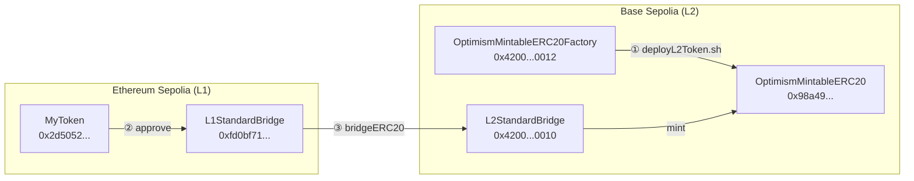

# 将 MyToken 从 Sepolia 跨链到 Base Sepolia

本文档记录使用 `cast` 将 L1（Ethereum Sepolia）上的 `MyToken` 桥接到 L2（Base Sepolia）的完整流程，对应脚本：

- `sh/deployL2Token.sh` — 在 L2 创建与 L1 配对的镜像代币
- `sh/bridgeL1TokenToL2.sh` — 在 L1 授权并执行跨链

## 流程概览



**执行顺序**：必须先完成 `deployL2Token.sh`，再执行 `bridgeL1TokenToL2.sh`。

## 前置条件

- 已安装 [Foundry](https://book.getfoundry.sh/getting-started/installation)（`cast`）
- 已在 Sepolia 部署 `MyToken`（参见 [deploy-mytoken-sepolia.md](./deploy-mytoken-sepolia.md)）
- 已配置 `foundry/.env`，并创建 keystore 账户 `deployer_1`
- `deployer_1` 在 Sepolia 上有足够 ETH 支付 Gas
- `deployer_1` 在 L1 MyToken 上有足够 MTK 余额

## 关键地址

| 名称 | 地址 | 网络 |
|------|------|------|
| L1 MyToken | `0x2d5052c008CFCCe8F0E18C1F35B296a367872f12` | Ethereum Sepolia |
| L2 MyToken | `0x98a49b93f5fe2c3b57f05596f6a857b0a8f4ee71` | Base Sepolia |
| L1 Standard Bridge | `0xfd0bf71f60660e2f608ed56e1659c450eb113120` | Ethereum Sepolia |
| L2 Standard Bridge | `0x4200000000000000000000000000000000000010` | Base Sepolia |
| L2 Token Factory | `0x4200000000000000000000000000000000000012` | Base Sepolia |
| 部署账户 deployer_1 | `0xff2903AF954a5EA4F093ce1dDA940A3bDD1a79E8` | 两链共用 |

说明：

- `0xfd0bf71...` 是 **Base 官方** 在 Sepolia 上部署的 L1 跨链桥，不是你的项目合约
- `0x4200...0012` 是 OP Stack 预部署的代币工厂，用于创建 L2 镜像代币
- L2 代币地址由 CREATE2 **确定性生成**，不是随机分配

## 第 1 步：在 L2 创建镜像代币

脚本：`sh/deployL2Token.sh`

```bash
cd foundry
source .env
bash sh/deployL2Token.sh
```

脚本内容：

```bash
cast send 0x4200000000000000000000000000000000000012 \
  "createOptimismMintableERC20(address,string,string)" \
  "0x2d5052c008CFCCe8F0E18C1F35B296a367872f12" \
  "MyToken" \
  "MTK" \
  --rpc-url https://base-sepolia-rpc.publicnode.com \
  --account deployer_1
```

### 做了什么

| 项目 | 说明 |
|------|------|
| 调用合约 | `OptimismMintableERC20Factory`（`0x4200...0012`） |
| 方法 | `createOptimismMintableERC20` |
| remoteToken | L1 MyToken 地址 |
| name / symbol | `MyToken` / `MTK` |
| 结果 | 在 Base Sepolia 部署 `OptimismMintableERC20` |

### L2 地址如何产生

工厂使用 **CREATE2** 确定性部署，salt 计算公式：

```solidity
bytes32 salt = keccak256(abi.encode(_remoteToken, _name, _symbol, _decimals));
```

对本项目：

| 参数 | 值 |
|------|-----|
| `_remoteToken` | `0x2d5052c008CFCCe8F0E18C1F35B296a367872f12` |
| `_name` | `"MyToken"` |
| `_symbol` | `"MTK"` |
| `_decimals` | `18`（默认） |

在 Base Sepolia 上，相同参数只能成功部署一次，得到的 L2 地址为：

`0x98a49b93f5fe2c3b57f05596f6a857b0a8f4ee71`

### 注意事项

- 此步骤 **不会** 转移 L1 代币，L2 余额仍为 0
- 每个 L1/L2 代币配对只需执行 **一次**
- 若 L1 地址、name、symbol 任一不同，L2 地址也会不同

## 第 2 步：跨链桥接 L1 → L2

脚本：`sh/bridgeL1TokenToL2.sh`

```bash
cd foundry
source .env
bash sh/bridgeL1TokenToL2.sh
```

包含 **两笔** Sepolia 交易。

### 2.1 approve — 授权 L1 桥

```bash
cast send 0x2d5052c008CFCCe8F0E18C1F35B296a367872f12 \
  "approve(address,uint256)" \
  "0xfd0bf71f60660e2f608ed56e1659c450eb113120" \
  "1000000000000000000000" \
  --rpc-url $SEPOLIA_RPC_URL \
  --account deployer_1
```

允许 L1 桥合约从你的地址转走最多 **1000 MTK**。

### 2.2 bridgeERC20 — 执行跨链

```bash
cast send 0xfd0bf71f60660e2f608ed56e1659c450eb113120 \
  "bridgeERC20(address,address,uint256,uint32,bytes)" \
  "0x2d5052c008CFCCe8F0E18C1F35B296a367872f12" \
  "0x98a49b93f5fe2c3b57f05596f6a857b0a8f4ee71" \
  "100000000000000" \
  "1000000" \
  "0x" \
  --rpc-url $SEPOLIA_RPC_URL \
  --account deployer_1
```

参数说明：

| 参数 | 值 | 含义 |
|------|-----|------|
| L1 代币 | `0x2d5052...` | 要锁定的 L1 MyToken |
| L2 代币 | `0x98a49...` | 目标 L2 镜像代币 |
| 数量 | `100000000000000` | `0.0001 MTK`（18 位小数） |
| minGasLimit | `1000000` | L2 执行所需最小 gas |
| extraData | `0x` | 无额外数据 |

### 链上实际流程

1. **L1**：桥合约从你的账户 **锁定** MTK
2. **消息传递**：通过 Cross Domain Messenger 发送跨链消息
3. **L2**：L2 桥在 `0x98a49...` 上 **mint** 等量代币到你的地址

跨链完成后通常需要等待 **数分钟**，L2 余额才会到账。

## 第 3 步：验证结果

### 查询 L1 余额（Sepolia）

```bash
cast call $MYTOKEN \
  "balanceOf(address)(uint256)" $DEPLOYER_ADDRESS \
  --rpc-url $SEPOLIA_RPC_URL
```

### 查询 L2 余额（Base Sepolia）

```bash
cast call 0x98a49b93f5fe2c3b57f05596f6a857b0a8f4ee71 \
  "balanceOf(address)(uint256)" $DEPLOYER_ADDRESS \
  --rpc-url $BASE_SEPOLIA_RPC_URL
```

### 确认 L2 代币配对关系

```bash
cast call 0x98a49b93f5fe2c3b57f05596f6a857b0a8f4ee71 \
  "remoteToken()(address)" \
  --rpc-url $BASE_SEPOLIA_RPC_URL
```

应返回 L1 MyToken 地址 `0x2d5052...`。

## 两个脚本对比

| | `deployL2Token.sh` | `bridgeL1TokenToL2.sh` |
|--|-------------------|------------------------|
| **网络** | Base Sepolia (L2) | Ethereum Sepolia (L1) |
| **目的** | 创建 L2 镜像代币 | 实际跨链转账 |
| **交易数** | 1 笔 | 2 笔（approve + bridge） |
| **L1 余额变化** | 无 | 减少（被锁定） |
| **L2 余额变化** | 无 | 增加（被 mint） |
| **执行频率** | 每个配对只需一次 | 每次跨链都要执行 |

## 常见问题

### 1. `ERC20InsufficientBalance`

```
ERC20InsufficientBalance(0xff2903..., 0, 100000000000000)
```

原因：L1 代币地址错误或账户余额不足。

排查：

```bash
cast call $MYTOKEN \
  "balanceOf(address)(uint256)" $DEPLOYER_ADDRESS \
  --rpc-url $SEPOLIA_RPC_URL
```

确保桥接脚本使用的是 `.env` 中的 `MYTOKEN`，而不是其他 Sepolia 上已存在的无关代币。

### 2. 误用 Sepolia 上其他代币地址

Sepolia 地址 `0x9B4810B4b24EF08528A62f15d772e7a18Fe44D1b` 对应的是 **UPT2026** 代币，不是本项目 MyToken。该地址 **不能** 作为 L1 MyToken 使用。

本项目 L1 MyToken 正确地址：`0x2d5052c008CFCCe8F0E18C1F35B296a367872f12`。

### 3. approve 成功但 bridge 失败

`approve` 只授权，不要求持有代币；`bridgeERC20` 会实际 `transferFrom`，必须有足够 L1 余额。

### 4. L2 余额迟迟不到账

跨链消息从 Sepolia 到 Base Sepolia 需要等待中继器处理，通常数分钟内完成。可在 [Base Sepolia Scan](https://sepolia.basescan.org/) 查看 L2 桥合约相关交易。

### 5. RPC 连接失败

若出现 `tls handshake eof` 等网络错误，可重试或更换 RPC：

```env
SEPOLIA_RPC_URL=https://ethereum-sepolia-rpc.publicnode.com
BASE_SEPOLIA_RPC_URL=https://base-sepolia-rpc.publicnode.com
```

## 部署记录（示例）

| 项目 | 值 |
|------|-----|
| L1 MyToken | `0x2d5052c008CFCCe8F0E18C1F35B296a367872f12` |
| L2 MyToken | `0x98a49b93f5fe2c3b57f05596f6a857b0a8f4ee71` |
| L2 创建交易 | [Base Sepolia Tx](https://sepolia.basescan.org/tx/0x0a90fca8222272cad13450f204a364a8e9be9930c19f463812badd219e30a9ad) |
| L1 网络 | Ethereum Sepolia |
| L2 网络 | Base Sepolia |

## 相关文件

| 文件 | 说明 |
|------|------|
| `sh/deployL2Token.sh` | 在 L2 创建 OptimismMintableERC20 |
| `sh/bridgeL1TokenToL2.sh` | L1 approve + bridgeERC20 |
| `.env` | RPC、MYTOKEN、DEPLOYER_ADDRESS 等 |
| `src/MyToken.sol` | L1 ERC20 代币合约 |
| `docs/deploy-mytoken-sepolia.md` | L1 部署文档 |

## 参考链接

- [OP Stack Predeploys](https://specs.optimism.io/interop/predeploys.html)
- [Sepolia Etherscan](https://sepolia.etherscan.io/)
- [Base Sepolia Scan](https://sepolia.basescan.org/)
- [Foundry Book - cast send](https://book.getfoundry.sh/reference/cast/cast-send)
